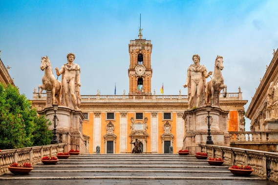

 <head>
   <meta charset="UTF-8">
   <meta name="viewport" content="width=device-width, initial-scale=1.0">
   <title>Rom: Die Hauptstadt einer antiken Weltmacht</title>
   <link rel="stylesheet" href="styles.css">
   
 </head>
 <body>
   <header>
     <h1>Rom: Die Hauptstadt einer antiken Weltmacht</h1>
   </header>
   
   <nav>
     <ul>
       <li><a href="#about-rome">Über Rom</a></li>
       <li><a href="#ancient-rome">Antikes Rom</a></li>
     </ul>
   </nav>
 
   <main>
     <section id="about-rome">
       <h2>Über Rom</h2>
       <article>
         <h3>Informationen über die Legenden von Rom</h3>
         
       
 •	Version des Plutarch: 
     
        
 In der Version von Plutarch hatte Amulius, der König von Alba Longa, seinen älteren Bruder Numitor vom Thron gestürzt. Dessen Tochter Rhea Silvia auch Ilia genannt zwang er, Vestalin zu werden. So wollte Amulius verhindern, dass in der Familie des Bruders Nachfahren entstünden, die seinen Thron gefährden könnten. Mars stieg jedoch zu ihrem Tempel hinab, vergewaltigte sie, und sie empfing von ihm die Zwillinge Romulus und Remus.
 Nach deren Geburt wurden die Kinder auf Amulius’s Befehl in einem Weidenkorb auf dem Tiber ausgesetzt und Ilia ins Gefängnis gebracht. Der Tiber führte jedoch gerade Hochwasser, und als das Wasser zurückging, strandete die Wanne am Ficus Ruminalis im Schlamm. Eine vom Schreien der Kinder angelockte Wölfin (Mamma Lupa) brachte sie in ihre Höhle und säugte sie. Ein Specht brachte ihnen zusätzlich Nahrung. Sie wurden jedoch von König Amulius’ Hirten Faustulus entdeckt. Faustulus, der Schweinehirt des Hofes, und seine Frau nahmen daraufhin die Kinder auf und zogen sie groß, ohne zu wissen, wer sie waren. (Dieser Abschnitt der Legende zeigt wie auch in der im Folgenden genannten Version – eine auffallende Parallele zur Erzählung von Phylonome und ihren Zwillingssöhnen Lykastos und Parrhasios.)
Romulus und Remus gerieten eines Tages in Streit mit den Hirten von Numitor und jagten ihnen sogar etwas von deren Vieh ab. Als Romulus einmal mit einem Opfer beschäftigt und Remus mit geringer Begleitung unterwegs war, trafen die Hirten des Numitor auf Remus und nahmen ihn gefangen. Er wurde Numitor vorgeführt und Remus berichtete, was er inzwischen über seine und seines Bruders Herkunft erfahren hatte. Daraufhin ahnte Numitor die Zusammenhänge. Als Faustulus von Remus’ Gefangenschaft erfuhr, weihte dieser auch Romulus in dessen Herkunftsgeschichte ein und spornte ihn an, Remus zu befreien. Er selbst wollte zu Numitor eilen, wurde aber abgefangen und zu Amulius gebracht. Unter Folter gestand er diesem so viel, dass Amulius den Numitor fragen ließ, ob dessen Enkel trotz Aussetzung noch lebten. Es brach ein Aufstand in der Stadt aus, als Romulus zur Befreiung seines Bruders ankam. So wurde der Tyrann Amulius gestürzt und getötet.
 
 
•	Version des Dionysios von Halikarnassos: 
 
 
Dionysios von Halikarnassos’ Version beginnt beim Befehl des Amulius, die Zwillinge in einem Korb auf einem Fluss auszusetzen. Der Korb strandete, und eine Wölfin hielt ihnen ihre Zitzen hin und säugte sie. Hirten hätten die Wölfin beobachtet und die Kinder gefunden. Die Wölfin habe sich dann entfernt, und die Hirten hätten die Zwillinge gerettet. Der Aufseher der königlichen Schweinehirten Faustulus, der gerade von der Entehrung der Ilia, ihrer Niederkunft und der Aussetzung ihrer Zwillinge erfahren hatte, habe die Zwillinge an sich genommen, ohne irgendjemandem von dem Zusammenhang etwas zu erzählen. Er habe ihnen die Namen Romulus und Remus gegeben. Sie seien ebenfalls Hirten geworden.
Als sie 18 Jahre alt geworden seien, habe es Streit zwischen ihnen und den Hirten des Numitor um Weideland zwischen dem Palatin und dem Aventin gegeben. Die Zwillinge hätten die Hirten des Numitor gewaltsam vertrieben. Diese hätten daraufhin den beiden eine Falle gestellt und deren Herden nachts überfallen. Da Romulus aber gerade wegen eines Opfers abwesend gewesen sei, hätten sie nur Remus gefangen und nach Alba gebracht. Romulus habe sofort die Verfolgung aufnehmen wollen, sei aber von Faustulus davon abgehalten worden. Faustulus habe ihm daraufhin seine Herkunft mitgeteilt. Daher habe sich Romulus entschlossen, eine größere Streitmacht zu sammeln, um gegen Amulius vorzugehen. Remus sei zu Numitor gebracht worden. Dieser habe ihm dann jegliche Strafe unter der Bedingung erlassen, dass er ihm gegen Amulius helfe. Dabei habe er auch vom traurigen Schicksal seiner Tochter und der erzwungenen Aussetzung der Zwillinge erzählt. Dann habe er einen Boten zu Romulus geschickt, damit dieser sich dem Kampf anschließen möge, was er auch getan habe.
Romulus habe dann Numitor das erzählt, was er von Faustulus erfahren hatte, und nun wusste Numitor, dass er seinen Enkel gefunden hatte. Faustulus, der von dieser Wendung der Dinge nichts gewusst habe, sei mit dem Korb, in dem die Zwillinge ausgesetzt waren, zur Stadt geeilt, um Numitor aufzuklären, sei aber von den Wachen des Amulius festgenommen worden. Diesem habe er die ganzen Umstände erzählen müssen. Amulius habe dann den Faustulus nach dem Aufenthaltsort befragt, weil er nunmehr die durch göttlichen Beistand geretteten Verwandten nicht länger Hirten sein lassen wolle. Faustulus habe Verdacht geschöpft, dass er sie in Wahrheit habe töten wollen, und ihm einen Ort in den Bergen genannt. Amulius habe Faustulus daraufhin mit einigen zuverlässigen Männern losgeschickt, denen er vorher heimlich den Befehl gegeben habe, die beiden Hirten gefangen zu nehmen und zu ihm zu bringen. Dann wollte er Numitor unter Arrest stellen, bis er die Situation mit den Zwillingen in seinem Sinne geregelt hätte, und sandte einen Boten zu Numitor mit der Bitte, zu ihm zu kommen. Der Bote habe aber dem Numitor den Plan des Amulius verraten. Daraufhin seien Numitor und die Zwillinge mit vielen Kriegern und den Bürgern der Stadt zum Palast geeilt, hätten ihn gestürmt und Amulius getötet.
        

            <article>
        <h3>Eine Karte von Rom</h3>
        

                     
        

      </article>
        <main>
    <section id="ancient-rome">
      <h2>Antikes Rom</h2>
      <article>
        <h3>Zeitachse mit wichtigen Ereignissen</h3>
        

        753 v. Chr.: Sagenhafte Gründung Roms
 
 
510 v. Chr.: Vertreibung des letzten Königs, Rom wird zur Republik
 
 
451/450 v. Chr.: Zwölftafelgesetze; erste Aufzeichnung des römischen Rechts
 
 
390 v. Chr.: Plünderung Roms durch die Gallier
 
 
287 v. Chr.: Ende des Ständekampfes zwischen Patriziern und Plebejern
 
 
264-241 v. Chr.: Erster Punischer Krieg gegen die Karthager
 
 
146 v. Chr.: Zerstörung von Karthago; Rom macht das Hinterland zur neuen römischen Provinz Africa
  
 
133 v. Chr.: Tiberius und Gaius Gracchus suchen nach Lösungen für soziale Probleme 
           

            <article>
        <h3>Beschreibungen von wichtigen Bauwerken</h3>
        

          Kolosseum von Rom:
          

Das Kolosseum wurde zum größten römischen Amphitheater mit einer ellipsenförmigen Struktur von 188 Metern Länge, einer Breite von 156 Metern und einer Höhe von 57 Metern. Gebaut aus     Ziegelsteinen und mit Travertinstein verkleidet, wurde es in fünf Ebenen geteilt und bot Platz für mehr als 50.000 Personen.
 

       
 

   

Zirkus Maximus:
   

Der Circus Maximus war der größte Veranstaltungsort für Shows, Aufführungen und Rennen der Antike. Mit 600 Metern Länge, 140 Metern Breite und einer Sitzplatzkapazität von etwa 300.000 Zuschauern wird er als das größte zu Unterhaltungszwecken gebaute Bauwerk der gesamten Menschheitsgeschichte gehandelt.
 
 
   
   
 
     

Forum Romanum:
       

Das Forum Romanum (Römischer Marktplatz) in Rom ist das älteste römische Forum und war Mittelpunkt des politischen, wirtschaftlichen, kulturellen und religiösen Lebens. Es liegt in einer Senke zwischen den drei Stadthügeln Kapitol, Palatin und Esquilin und war der Ort vieler öffentlicher Gebäude und Denkmäler.
 
 
    
   
 
     

Pantheon:
       

Das Pantheon besteht aus zwei Hauptelementen: einem Pronaos mit rechteckigem Grundriss und Tempelfassade im Norden sowie einem kreisrunden, überkuppelten Zentralbau im Süden. Ein Übergangsbereich vermittelt zwischen beiden Gebäudeteilen, die sich ergebenden Zwickel der Schnittstellen wurden für Treppenhäuser genutzt.
 
 
   
   
 
     

Kapitol:
       

Das Kapitol in Rom, auch bekannt als Kapitolinische Hügel, ist einer der sieben Hügel, auf denen die antike Stadt Rom erbaut wurde. Es beherbergt heute bedeutende Bauwerke wie die Kapitolinischen Museen und den Tempel des Jupiter Optimus Maximus.
 
 
   

   
   
 
Konstantin Bogen:
     

Der Konstantinsbogen (etwa 25 Meter hoch) ist der größte unter den drei Triumphbögen, die in Rom noch erhalten sind. Das Denkmal wurde auf der sogenannten "Via Triumphalis" errichtet. Diesen Weg schlugen traditionell alle Triumphatoren ein, wenn sie vom Circus Maximus kommend den Titus-Bogen erreichten.
 
 
   
   
 
     

Titusbogen:
       

Der direkt an der Via Sacra errichtete Bogen ist der älteste Triumphbogen auf dem Forum. Er besteht aus 1 Bogen und ist etwa 15,4 Meter hoch, 13,5 Meter breit und 4,75 Meter tief. Auf dem Bogen wurden mit der Niederschlagung des Judäeraufstands und der Eroberung Jerusalems 70 n.
      

     

